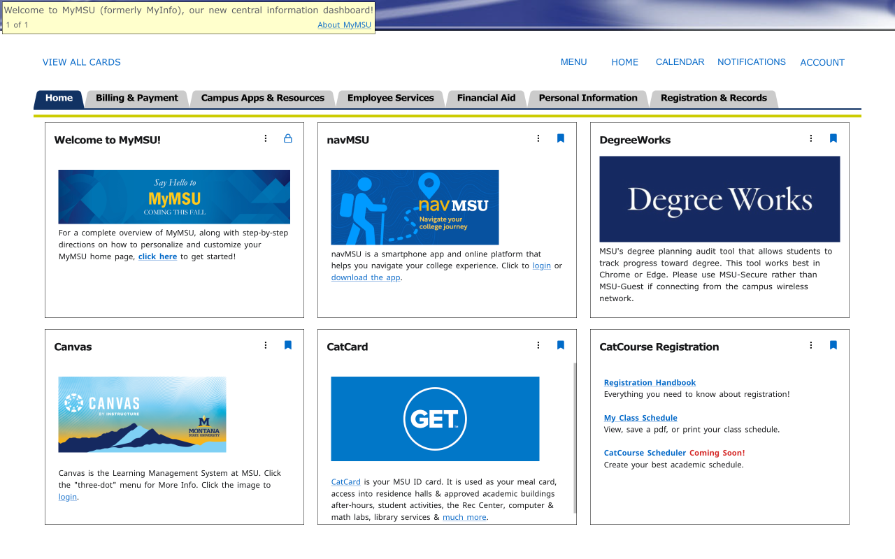

# MyMSU-

[](https://chrome.google.com/webstore/detail/ffjonbbbbafjifhceejijkkpkaalfhmn)
[](https://addons.mozilla.org/firefox/addon/mymsu-/)
[](https://microsoftedge.microsoft.com/addons/detail/mymsu-/ihgglaeohfaojihajollnckfpdjdnbmn)


[](https://chrome.google.com/webstore/detail/ffjonbbbbafjifhceejijkkpkaalfhmn)
[](https://addons.mozilla.org/firefox/addon/mymsu-/)
[![](https://img.shields.io/badge/dynamic/json?style=flat-square&logo=data:image/svg+xml;base64,PHN2ZyB4bWxucz0iaHR0cDovL3d3dy53My5vcmcvMjAwMC9zdmciIHZpZXdCb3g9IjAgMCAyNCAyNCI+PHBhdGggZD0iTTIxLjg2IDE3Ljg2cS4xNCAwIC4yNS4xMi4xLjEzLjEuMjV0LS4xMS4zM2wtLjMyLjQ2LS40My41My0uNDQuNXEtLjIxLjI1LS4zOC40MmwtLjIyLjIzcS0uNTguNTMtMS4zNCAxLjA0LS43Ni41MS0xLjYuOTEtLjg2LjQtMS43NC42NHQtMS42Ny4yNHEtLjkgMC0xLjY5LS4yOC0uOC0uMjgtMS40OC0uNzgtLjY4LS41LTEuMjItMS4xNy0uNTMtLjY2LS45Mi0xLjQ0LS4zOC0uNzctLjU4LTEuNi0uMi0uODMtLjItMS42NyAwLTEgLjMyLTEuOTYuMzMtLjk3Ljg3LTEuOC4xNC45NS41NSAxLjc3LjQxLjgyIDEuMDIgMS41LjYuNjggMS4zOCAxLjIxLjc4LjU0IDEuNjQuOS44Ni4zNiAxLjc3LjU2LjkyLjIgMS44LjIgMS4xMiAwIDIuMTgtLjI0IDEuMDYtLjIzIDIuMDYtLjcybC4yLS4xLjItLjA1em0tMTUuNS0xLjI3cTAgMS4xLjI3IDIuMTUuMjcgMS4wNi43OCAyLjAzLjUxLjk2IDEuMjQgMS43Ny43NC44MiAxLjY2IDEuNC0xLjQ3LS4yLTIuOC0uNzQtMS4zMy0uNTUtMi40OC0xLjM3LTEuMTUtLjgzLTIuMDgtMS45LS45Mi0xLjA3LTEuNTgtMi4zM1QuMzYgMTQuOTRRMCAxMy41NCAwIDEyLjA2cTAtLjgxLjMyLTEuNDkuMzEtLjY4LjgzLTEuMjMuNTMtLjU1IDEuMi0uOTYuNjYtLjQgMS4zNS0uNjYuNzQtLjI3IDEuNS0uMzkuNzgtLjEyIDEuNTUtLjEyLjcgMCAxLjQyLjEuNzIuMTIgMS40LjM1LjY4LjIzIDEuMzIuNTcuNjMuMzUgMS4xNi44My0uMzUgMC0uNy4wNy0uMzMuMDctLjY1LjIzdi0uMDJxLS42My4yOC0xLjIuNzQtLjU3LjQ2LTEuMDUgMS4wNC0uNDguNTgtLjg3IDEuMjYtLjM4LjY3LS42NSAxLjM5LS4yNy43MS0uNDIgMS40NC0uMTUuNzItLjE1IDEuMzh6TTExLjk2LjA2cTEuNyAwIDMuMzMuMzkgMS42My4zOCAzLjA3IDEuMTUgMS40My43NyAyLjYyIDEuOTMgMS4xOCAxLjE2IDEuOTggMi43LjQ5Ljk0Ljc2IDEuOTYuMjggMSAuMjggMi4wOCAwIC44OS0uMjMgMS43LS4yNC44LS42OSAxLjQ4LS40NS42OC0xLjEgMS4yMi0uNjQuNTMtMS40NS44OC0uNTQuMjQtMS4xMS4zNi0uNTguMTMtMS4xNi4xMy0uNDIgMC0uOTctLjAzLS41NC0uMDMtMS4xLS4xMi0uNTUtLjEtMS4wNS0uMjgtLjUtLjE5LS44NC0uNS0uMTItLjA5LS4yMy0uMjQtLjEtLjE2LS4xLS4zMyAwLS4xNS4xNi0uMzUuMTYtLjIuMzUtLjUuMi0uMjguMzYtLjY4LjE2LS40LjE2LS45NSAwLTEuMDYtLjQtMS45Ni0uNC0uOTEtMS4wNi0xLjY0LS42Ni0uNzQtMS41Mi0xLjI4LS44Ni0uNTUtMS43OS0uODktLjg0LS4zLTEuNzItLjQ0LS44Ny0uMTQtMS43Ni0uMTQtMS41NSAwLTMuMDYuNDVULjk0IDcuNTVxLjcxLTEuNzQgMS44MS0zLjEzIDEuMS0xLjM4IDIuNTItMi4zNVE2LjY4IDEuMSA4LjM3LjU4cTEuNy0uNTIgMy41OC0uNTJaIiBzdHlsZT0iZmlsbDojZmZmIi8+PC9zdmc+&label=Edge&prefix=v&color=067FD8&query=%24.version&url=https%3A%2F%2Fmicrosoftedge.microsoft.com%2Faddons%2Fgetproductdetailsbycrxid%2Fihgglaeohfaojihajollnckfpdjdnbmn)](https://microsoftedge.microsoft.com/addons/detail/mymsu-/ihgglaeohfaojihajollnckfpdjdnbmn)


[](https://github.com/FlamedDogo99/MyMSU-/releases)
[](https://github.com/FlamedDogo99/MyMSU-/blob/master/LICENSE)

## About

Missing the 1990's aesthetic of Montana State University's MyInfo website?
MyMSU- brings back that nostalgic look of MyInfo, removing unnecessary animations, scrolling and clutter.

Need to disable the stylesheet quickly? No problem! Just press the extension icon </img>

Now lets see some comparisons:

|                        Bland, modern MyMSU                        |                   Stylized, performant MyMSU-                   |
|:-----------------------------------------------------------------:|:---------------------------------------------------------------:|
|            |            |
|  |  |

## Manual Installation

Want to use MyMSU- but can't install it through Chrome, Firefox or Edge? No problem! All changes to the DOM
are done through a single stylesheet, allowing MyInfo- to easily be packaged as a userscript, found [here](https://raw.githubusercontent.com/FlamedDogo99/MyMSU-/refs/heads/main/userscript/myinfominus.user.js).

What userscript application should I use?
<details>
<summary>Read more</summary>

---

Non-mobile browsers:
- Chrome, FireFox, Safari, Edge, Opera Next, Microsoft Edge: [Tampermonkey](https://www.tampermonkey.net)

iOS:
- Safari: [Userscripts](https://apps.apple.com/us/app/userscripts/id1463298887)
- Orion: [Tampermonkey](https://www.tampermonkey.net)

Android:
- FireFox: [Tampermonkey](https://www.tampermonkey.net)
- Kiwi Browser: [Tampermonkey](https://www.tampermonkey.net)

---

</details>

If you want to download the source, no building is required. The best way to download the source is with Git:

```sh
git clone https://github.com/FlamedDogo99/MyMSU-.git
```
## License

MyMSU- is licensed under the terms of the [MIT License](https://github.com/FlamedDogo99/EaglerMobile/blob/main/LICENSE).
